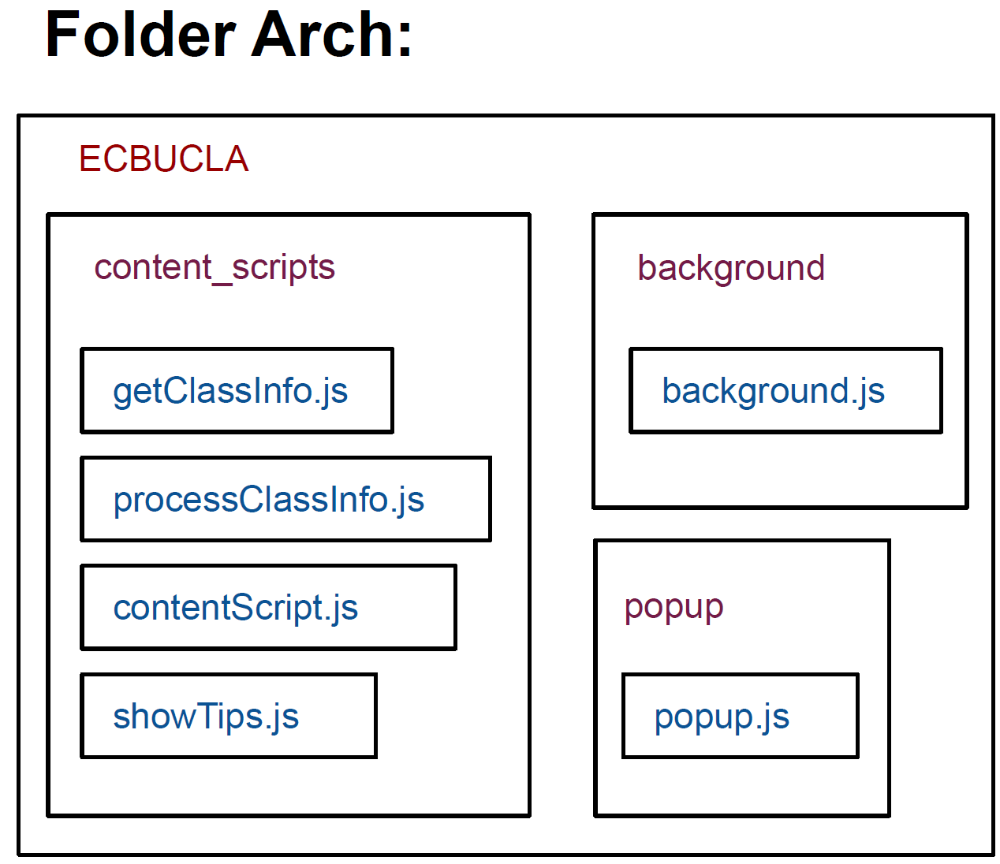
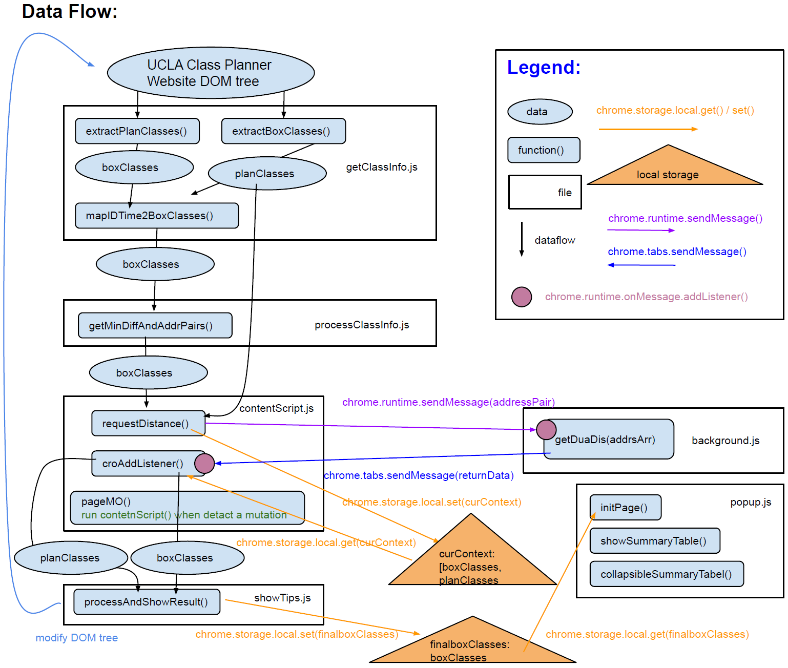

# Easy Class Break (UCLA)
## Introduction
Find out the classes whose break is not enough to walk to the next class.
  
The extension will check all class breaks in the Class Planner. If the extension find a class whose break is not enough to walk to the next class, that is (break time - walking time) <= 2min, the extension will insert a red button below the location box in the Class Planner to tip you.
  
The red button will be ["Ori"+ weekday] (not enough time to get next class + the class on which weekday) or ["Dest"+ weekday] (not enough time to go from previous class + the class on which weekday).
Hover over the red button will display more information about next/previous class and time/distance.
Click the icon of the extension will pop up a window for adjusting the remaining time you want to reserve (0-10 min, 2 min is default). The reset button will reset the remaining time to default.
Select Tip Button used to select which type tip button appears in the Class Planner.
  
Summary table shows BreakTime, WalkTime, ResTime and Distance of every class pairs, and hurry class pair is shown in red. The triangle next to [Summary] can collapse the summary table.

This Chrome extension is on https://chrome.google.com/webstore/detail/easy-class-break-ucla/cinodjcaojlhljfgnmcmbfogamicehmo

## Architecture
To understand the architecture, make sure you have read [Message passing](https://developer.chrome.com/docs/extensions/mv2/messaging/), [Content scripts](https://developer.chrome.com/docs/extensions/mv2/content_scripts/) and [Manage events with background scripts](https://developer.chrome.com/docs/extensions/mv2/background_pages/). Then, make sure you understand the extension sample [Mappy](https://github.com/GoogleChrome/chrome-extensions-samples/tree/main/mv2-archive/extensions/mappy), which is very similar to the initial architecture of this extension.
  
The architecture of the folder ECBUCLA:  

  
Data Flow:  

  
1. Extract the box class info from the class schedule (upper boxes). Extract the plan class info from the class schedule (lower tables). 

2. Notice that `getMinDiffAndPairs()` is the core algorithm.  

3. The separated `background.js` is designed to meet Google's recommended practice. `background.js` is reserved for heavy computing and external API usage.  

4. `chrome.tabs.sendMessage()` make sure the behavior between tabs is correct. Be careful with the message passing.  

5. The paradigm of context save/restore is very important in `contentScript.js`, especially in Manifest v3 since the background become service worker.  

6. Use MutationObserver to detect a mutaion and re-run `contentScript()`.  
  
## About
* Idea:  
In a quarter, I had a discussion session in Boelter Hall, and next discussion session in Public Affairs Building, it took me a long time to walk, and it is inconveninent to ask TA questions after discussion. Then, the idea of the extension was inspired by the discussion with Jonathan of this situation.
  
* Acknowledgment:  
The Chromium Authors' Mappy chrome extension  
Inspired by [@RobertUrsua](https://github.com/robertursua) and [@preethamrn](https://github.com/preethamrn)'s [Easy BruinWalk Ratings (UCLA) extension](https://github.com/preethamrn/BruinWalkChromeExtension)  
Stack Overflow's answer contributor
  
* Disclaimer:  
This extension uses Google Analytics to collect usage statistics to help improve user experience. If you want to opt-out of Google Analytics tracking, please visit http://tools.google.com/dlpage/gaoptout.
